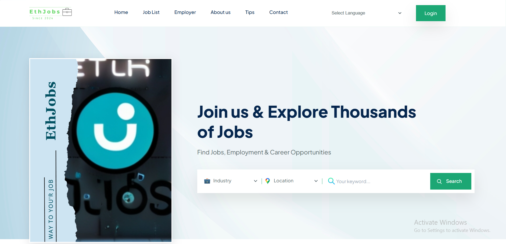

# 🌟 Job-Portal 🌟

[](https://laravel.com)
[](https://php.net)
[](LICENSE)
[](#)

> **Empowering Ethiopia's Workforce: Connecting Talent with Opportunity** 🚀

Eth-Job (ኢት-ጆብ) is a comprehensive, modern job portal platform designed specifically for the Ethiopian job market. Built with cutting-edge technology, EthJobs bridges the gap between talented job seekers and forward-thinking employers, fostering career growth and business success across Ethiopia.



## ✨ Key Features

### 🔍 **For Job Seekers**
- **Advanced Job Search**: Filter by location, category, salary, experience, and more
- **Personalized Profiles**: Create detailed CVs with skills, experience, and education
- **One-Click Applications**: Apply to jobs instantly with your profile
- **Job Bookmarks**: Save favorite opportunities for later
- **AI-Powered Support**: Get intelligent career guidance and recommendations
- **Real-time Notifications**: Stay updated on application status and new opportunities

### 🏢 **For Employers**
- **Comprehensive Company Profiles**: Showcase your brand with logos, banners, and detailed information
- **Flexible Job Posting**: Create detailed job listings with custom requirements
- **Premium Features**: Highlight jobs, feature listings, and boost visibility
- **Application Management**: Review and manage candidate applications efficiently
- **Analytics Dashboard**: Track job performance and hiring metrics
- **Payment Integration**: Secure payments via Stripe, PayPal, and Razorpay

### 🛠️ **Admin Panel**
- **User Management**: Oversee all users, companies, and candidates
- **Content Management**: Manage blogs, pages, and system settings
- **Permission System**: Role-based access control with Spatie Laravel Permission
- **Data Export**: Export database and reports in various formats
- **System Monitoring**: Comprehensive logging and error tracking

### 🎨 **Modern UI/UX**
- **Responsive Design**: Optimized for desktop, tablet, and mobile devices
- **Dark/Light Themes**: User preference-based theming
- **Intuitive Navigation**: Clean, modern interface with Tailwind CSS
- **Interactive Elements**: Alpine.js powered dynamic components

## 🛠️ Tech Stack

### Backend
- **Framework**: Laravel 10.x
- **Language**: PHP 8.1+
- **Database**: MySQL
- **Authentication**: Laravel Sanctum
- **Permissions**: Spatie Laravel Permission
- **Payments**: Stripe, PayPal, Razorpay
- **PDF Generation**: DomPDF, Snappy
- **Email**: Laravel Mail with custom templates

### Frontend
- **CSS Framework**: Tailwind CSS
- **JavaScript**: Alpine.js
- **Build Tool**: Vite
- **Icons**: Heroicons / Custom SVG
- **Charts**: Chart.js (if applicable)

### DevOps & Tools
- **Version Control**: Git
- **Testing**: PHPUnit
- **Code Quality**: Laravel Pint
- **Debugging**: Laravel Debugbar
- **IDE Helper**: Laravel IDE Helper

## 🚀 Quick Start

### Prerequisites
- PHP 8.1 or higher
- Composer
- Node.js & NPM
- MySQL 5.7+
- Git

### Installation

1. **Clone the Repository**
   ```bash
   git clone https://github.com/your-username/ethjobs-portal.git
   cd ethjobs-portal
   ```

2. **Install PHP Dependencies**
   ```bash
   composer install
   ```

3. **Install Node Dependencies**
   ```bash
   npm install
   ```

4. **Environment Setup**
   ```bash
   cp .env.example .env
   php artisan key:generate
   ```

5. **Database Configuration**
   - Create a MySQL database
   - Update `.env` with database credentials
   - Run migrations and seeders:
   ```bash
   php artisan migrate
   php artisan db:seed
   ```

6. **Build Assets**
   ```bash
   npm run build
   # or for development
   npm run dev
   ```

7. **Start the Application**
   ```bash
   php artisan serve
   ```

8. **Access the Portal**
   - Frontend: `http://localhost:8000`
   - Admin Panel: `http://localhost:8000/admin`

## 📖 Usage Guide

### For Job Seekers
1. **Register**: Create your account and complete your profile
2. **Build Your CV**: Add education, experience, skills, and certifications
3. **Search Jobs**: Use filters to find relevant opportunities
4. **Apply**: Submit applications with one click
5. **Track Progress**: Monitor your applications in the dashboard

### For Employers
1. **Company Setup**: Complete your company profile
2. **Post Jobs**: Create detailed job listings
3. **Review Applications**: Manage incoming applications
4. **Upgrade Plans**: Access premium features for better visibility

### For Administrators
1. **User Management**: Oversee all platform users
2. **Content Moderation**: Manage job posts and company profiles
3. **System Configuration**: Adjust settings and preferences


## 🤖 AI Features

EthJobs incorporates AI-powered features to enhance the job search experience:

- **Smart Job Matching**: AI algorithms match candidates to suitable positions
- **Resume Optimization**: Suggestions for improving CV effectiveness
- **Career Guidance**: Personalized advice based on user profiles
- **Application Tracking**: Intelligent follow-up reminders

## 📊 Database Schema

The application uses a comprehensive database schema including:

- **Users**: Authentication and basic user info
- **Candidates**: Detailed job seeker profiles
- **Companies**: Employer information and settings
- **Jobs**: Job postings with full specifications
- **Applications**: Job application tracking
- **Plans**: Subscription and payment management
- **Blogs**: Content management system

## 🧪 Testing

Run the test suite:
```bash
php artisan test
```

## 📦 Deployment

### Production Setup
1. Configure web server (Apache/Nginx)
2. Set up SSL certificate
3. Configure environment variables
4. Run database migrations
5. Set up cron jobs for scheduled tasks
6. Configure file storage (local/S3)

### Docker Support
Docker configuration coming soon! 🐳

## 🤝 Contributing

We welcome contributions from the community! Here's how you can help:

1. **Fork** the repository
2. **Create** a feature branch (`git checkout -b feature/amazing-feature`)
3. **Commit** your changes (`git commit -m 'Add amazing feature'`)
4. **Push** to the branch (`git push origin feature/amazing-feature`)
5. **Open** a Pull Request

### Development Guidelines
- Follow PSR-12 coding standards
- Write tests for new features
- Update documentation as needed
- Use meaningful commit messages

## 📄 License

This project is licensed under the MIT License - see the [LICENSE](LICENSE) file for details.

- **Nathnael Wondwosen** - Full-Stack Developer & Database Architect

## 🙏 Acknowledgments

- Laravel Framework for the robust backend foundation
- Tailwind CSS for beautiful, responsive design
- Alpine.js for reactive frontend components
- All contributors and the open-source community

## 📞 Support

- **Email**: natiwond95@gmail.com

## 🔄 Version History

- **v1.0.0** (Current)
  - Initial release with core job portal features
  - AI-powered job matching
  - Multi-role user system
  - Payment integration
  - Admin panel

---

<p align="center">
  Made with ❤️ in Ethiopia 🇪🇹<br>
  <em>Nathnael, Building Futures</em>
</p>

<div align="center">

  
  
  
  
  

</div>

## Contributing

Thank you for considering contributing to the Laravel framework! The contribution guide can be found in the [Laravel documentation](https://laravel.com/docs/contributions).

## Code of Conduct

In order to ensure that the Laravel community is welcoming to all, please review and abide by the [Code of Conduct](https://laravel.com/docs/contributions#code-of-conduct).

## Security Vulnerabilities

If you discover a security vulnerability within Laravel, please send an e-mail to Taylor Otwell via [taylor@laravel.com](mailto:taylor@laravel.com). All security vulnerabilities will be promptly addressed.

## License

The Laravel framework is open-sourced software licensed under the [MIT license](https://opensource.org/licenses/MIT).
